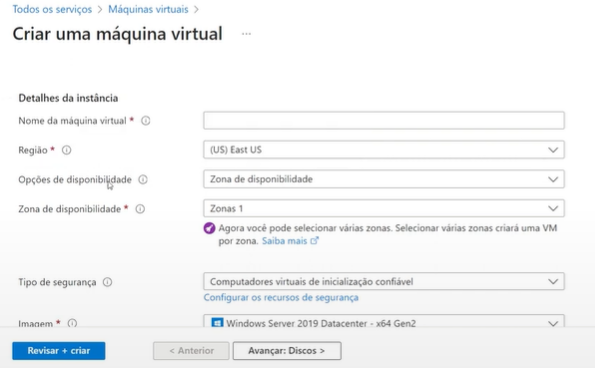
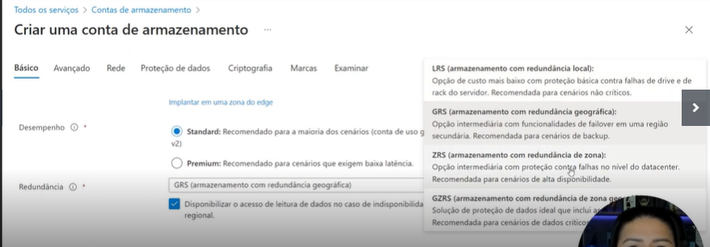

# ☁️ Desafio 2 

Microsoft 50 Anos: Computação em Nuvem com Azure

Este repositório documenta a atividade prática realizada durante o curso de Computação em Nuvem com Azure, focando na criação de **Máquinas Virtuais (VMs)**, tipos de **redundância de armazenamento**, e os impactos no **SLA (Acordo de Nível de Serviço)**.

---

## 💻 Criando uma Máquina Virtual (VM)

Durante a atividade, foi realizada a criação de uma **VM (Virtual Machine)** no portal Azure. A configuração envolveu:

- Escolha da região: `(US) East US`
- Definição de uma **zona de disponibilidade** (implica diretamente no SLA)
- Imagem: `Windows Server 2019 Datacenter - x64 Gen2`
- Tipo de segurança: Inicialização confiável

📷 *Criando uma máquina virtual:*

---

## 📦 Criando uma Conta de Armazenamento

Ao criar uma conta de armazenamento no Azure, foi possível selecionar entre diferentes **opções de redundância**:

- **LRS** – Redundância local
- **GRS** – Redundância geográfica
- **ZRS** – Redundância de zona
- **GZRS** – Redundância geográfica com zona

Essas opções impactam **diretamente no SLA e no custo** da solução.

📷 *Replicação de dados no armazenamento:*

---

## 🔄 SLA em Nuvem (Service Level Agreement)

**Dica:**

Quanto **mais noves** no SLA (ex: 99,999%), **menor será o tempo de inatividade permitido**. Ou seja, maior a **confiabilidade** da solução.

| SLA        | Inatividade por mês | Inatividade por ano |
|------------|---------------------|----------------------|
| 99%        | 7,2 horas            | 3,65 dias            |
| 99,9%      | 43,2 minutos         | 8,76 horas           |
| 99,95%     | 21,6 minutos         | 4,38 horas           |
| 99,99%     | 4,32 minutos         | 52,56 minutos        |
| 99,999%    | 25,9 segundos        | 5,26 minutos         |

📷 *Tabela de SLA:*

---

## 🧠 Aprendizados e Observações

- Quanto **maior a disponibilidade (SLA)**, maior o custo.
- Usar **zonas de disponibilidade** e **redundância adequada** garante mais **confiabilidade** e **resiliência**.
- A **Azure oferece diferentes tipos de replicação de dados**, o que influencia diretamente na estratégia de backup e continuidade de negócios.
- Essa prática me ajudou a entender melhor como configurar infraestrutura básica em nuvem, com foco em **disponibilidade, escalabilidade e segurança**.

---

## ✅ Conclusão

Essa atividade prática foi essencial para visualizar os conceitos de **infraestrutura em nuvem**, além de experimentar configurações reais no portal Azure. Entender como as decisões de arquitetura afetam diretamente o **SLA, custo e desempenho** é fundamental para atuar com soluções em nuvem de forma estratégica.

